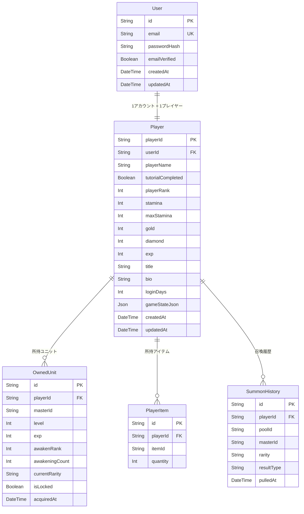

# アルカナブレイド ソース解析・学習用資料

## ～剣と召喚の覇者～ 完全技術解説書

**作成日:** 2026年6月29日  
**対象バージョン:** 0.0.0（初期実装）  
**解析対象:** `C:\Users\y-okawa\Desktop\appsetting\arukanabrade`

---

# 目次

1. [アプリ概要](#1-アプリ概要)
2. [技術スタック](#2-技術スタック)
3. [全体アーキテクチャ](#3-全体アーキテクチャ)
4. [ディレクトリ構成](#4-ディレクトリ構成)
5. [DB設計](#5-db設計)
6. [ER図（Mermaid）](#6-er図)
7. [API一覧](#7-api一覧)
8. [画面・API・DB連携図](#8-画面apidb連携図)
9. [主要機能別処理フロー](#9-主要機能別処理フロー)
10. [ソースファイル別解説](#10-ソースファイル別解説)
11. [TypeScript学習](#11-typescript学習)
12. [React / Next.js学習](#12-react--nextjs学習)
13. [Prisma / PostgreSQL学習](#13-prisma--postgresql学習)
14. [認証処理学習](#14-認証処理学習)
15. [エラー・改善点](#15-エラー改善点)
16. [学習ロードマップ](#16-学習ロードマップ)
17. [今後の開発方針](#17-今後の開発方針)
18. [まとめ](#18-まとめ)

---

# 1. アプリ概要

## このアプリは何か

**アルカナブレイド ～剣と召喚の覇者～** は、ブラウザで遊べるスマートフォン向け **ダークファンタジー ターン制RPG** です。

## ゲームとしての主要機能

| 機能カテゴリ | 内容 |
|------------|------|
| チュートリアル | タイトル→キャラ作成→バトル体験→初回ガチャまでの7段階フロー |
| バトル | ターン制・属性相性あり・スキル使用可能 |
| 召喚（ガチャ） | 5種の召喚プール・N/R/SR/SSR排出・被り時は覚醒結晶 |
| ユニット育成 | レベルアップ・進化（★1～★7→★👑）・覚醒（素材・ガチャ被り） |
| クエスト | ワールド→エリア→ステージの階層構造 |
| パーティ編成 | 最大5体、複数パーティ作成可能 |
| ギルド | 作成・参加・チャット・ミッション |
| アリーナ(PvP) | ポイント制ランキング対戦 |
| レイド | 複数プレイヤーでボスを倒す |
| ショップ | Gold/Diamond での購入 |
| デイリーミッション | 毎日リセット・報酬獲得 |
| ログインボーナス | 30日サイクル、Day30はSSR確定チケット |
| スタミナシステム | 5分で1回復、ランクアップで上限増加 |

## 実装済み機能一覧

```
✅ ユーザー登録・ログイン（JWT + bcrypt）
✅ プレイヤーデータ管理（通貨・スタミナ・ランク）
✅ 7段階チュートリアルフロー
✅ 70体以上のユニットマスターデータ
✅ ターン制バトルエンジン（属性相性・スキル・BB）
✅ 5種のガチャプール・10連召喚
✅ ユニット育成（★1→★👑まで）
✅ 素材覚醒・ガチャ被り覚醒システム
✅ パーティ編成（最大5体・複数パーティ）
✅ クエストマップ（ワールド・エリア・ステージ）
✅ スタミナシステム（5分回復）
✅ ゴールド・ダイヤ管理
✅ 装備システム
✅ ギルド機能
✅ アリーナ/PvP
✅ レイド
✅ デイリー/ウィークリーミッション
✅ ログインボーナス（30日）
✅ フレンドシステム
✅ シナリオ画面
✅ プロフィール・称号設定
✅ PWA対応（インストール可能）
✅ localStorage自動保存 + PostgreSQL DBバックアップ
✅ Tailwind CSSによるレスポンシブデザイン
```

---

# 2. 技術スタック

## フロントエンド

| 技術 | バージョン | 役割 |
|------|----------|------|
| React | 19.2.7 | UIフレームワーク |
| TypeScript | 6.0.2 | 型安全な開発言語 |
| Vite | 8.1.0 | ビルドツール・開発サーバー |
| React Router | 7.18.0 | SPAルーティング |
| Zustand | 5.0.14 | 状態管理ライブラリ |
| Tailwind CSS | 4.3.1 | ユーティリティファーストCSS |
| lucide-react | 1.21.0 | アイコンライブラリ |
| vite-plugin-pwa | 1.3.0 | PWA対応 |

## バックエンド

| 技術 | バージョン | 役割 |
|------|----------|------|
| Vercel Serverless | (@vercel/node 5.8.21) | APIホスティング |
| Prisma | 5.22.0 | ORM（DBアクセス） |
| PostgreSQL | (Railway想定) | リレーショナルDB |
| jsonwebtoken | 9.0.3 | JWT認証 |
| bcryptjs | 3.0.3 | パスワードハッシュ |

## 開発ツール

| 技術 | 役割 |
|------|------|
| oxlint | Linter（高速） |
| TypeScript | 型チェック |
| npm | パッケージ管理 |

---

# 3. 全体アーキテクチャ

## システム構成図

```
┌─────────────────────────────────────────────────────────┐
│                   ユーザー（ブラウザ）                    │
│                  PWA対応（インストール可能）               │
└─────────────────────┬───────────────────────────────────┘
                       │ HTTPS
┌──────────────────────▼──────────────────────────────────┐
│                    Vercel Edge                           │
│  ┌─────────────────────────────────────────────────┐   │
│  │              フロントエンド (SPA)                  │   │
│  │  React 19 + TypeScript + Vite + Tailwind CSS      │   │
│  │                                                   │   │
│  │  ┌─────────────────────────────────────────────┐ │   │
│  │  │         Zustand 状態管理（12ストア）           │ │   │
│  │  │  authStore / playerStore / unitStore         │ │   │
│  │  │  partyStore / questStore / tutorialStore    │ │   │
│  │  │  ...                                        │ │   │
│  │  └─────────────────────────────────────────────┘ │   │
│  │                                                   │   │
│  │  ┌─────────────────────────────────────────────┐ │   │
│  │  │         localStorage（即時永続化）             │ │   │
│  │  │  arcana-player / arcana-units / ...          │ │   │
│  │  └─────────────────────────────────────────────┘ │   │
│  └─────────────────────────────────────────────────┘   │
│                                                          │
│  ┌─────────────────────────────────────────────────┐   │
│  │           Vercel Serverless Functions             │   │
│  │  /api/auth/*   /api/player/*                    │   │
│  │  /api/summon/* /api/units/*                     │   │
│  └─────────────────┬───────────────────────────────┘   │
└─────────────────────┼───────────────────────────────────┘
                       │ Prisma ORM
┌──────────────────────▼──────────────────────────────────┐
│                  Railway PostgreSQL                       │
│  User / Player / OwnedUnit / PlayerItem / SummonHistory │
└─────────────────────────────────────────────────────────┘
```

## データ永続化の二重構造

```
ゲームプレイ
    │
    ▼
Zustandストア（メモリ上）
    │
    ├──→ localStorage（即時・自動）
    │      Zustand persist で自動管理
    │
    └──→ PostgreSQL（1.5秒デバウンス自動保存）
           /api/player/saveAll で保存
           gameStateJson カラム（JSON全体）
           + 正規化カラム（重要数値）

ページ再読み込み時:
    GET /api/auth/me
    → gameStateJson を取得
    → hydrateFromGameState()
    → 全ストアに復元
```

---

# 4. ディレクトリ構成

## プロジェクト全体

```
arukanabrade/
├── api/                    ← Vercel Serverless API（バックエンド）
│   ├── auth/               ← 認証API
│   ├── player/             ← プレイヤーAPI
│   ├── summon/             ← 召喚API
│   └── units/              ← ユニットAPI
│
├── lib/                    ← バックエンド共通ライブラリ
│   ├── auth.ts             ← JWT・Cookie管理
│   ├── prisma.ts           ← Prisma Clientシングルトン
│   └── syncService.ts      ← ゲーム状態DB同期
│
├── prisma/                 ← データベース設定
│   ├── schema.prisma       ← DBスキーマ定義
│   └── migrations/         ← マイグレーション履歴
│
├── src/                    ← フロントエンドソース
│   ├── main.tsx            ← エントリーポイント
│   ├── App.tsx             ← ルートコンポーネント・ルーティング
│   │
│   ├── features/           ← 機能別画面コンポーネント（20機能）
│   │   ├── auth/           ← 登録画面
│   │   ├── login/          ← ログイン画面
│   │   ├── tutorial/       ← チュートリアル（7段階）
│   │   ├── home/           ← ホーム画面
│   │   ├── units/          ← ユニット一覧・詳細
│   │   ├── party/          ← パーティ編成
│   │   ├── quests/         ← クエストマップ
│   │   ├── battle/         ← バトル画面
│   │   ├── summon/         ← 召喚（ガチャ）
│   │   ├── enhance/        ← 強化・覚醒
│   │   ├── items/          ← アイテム管理
│   │   ├── equipment/      ← 装備管理
│   │   ├── missions/       ← ミッション
│   │   ├── raid/           ← レイド
│   │   ├── guild/          ← ギルド
│   │   ├── pvp/            ← アリーナ
│   │   ├── profile/        ← プロフィール
│   │   ├── shop/           ← ショップ
│   │   ├── scenario/       ← シナリオ
│   │   └── debug/          ← 開発者ツール
│   │
│   ├── stores/             ← Zustand状態管理（12ストア）
│   ├── data/               ← マスターデータ（静的JSON）
│   ├── types/              ← TypeScript型定義
│   ├── utils/              ← ユーティリティ関数
│   ├── hooks/              ← カスタムReactフック
│   ├── lib/                ← フロントエンド共通ライブラリ
│   └── components/         ← 共通UIコンポーネント
│
├── package.json            ← 依存ライブラリ定義
├── vite.config.ts          ← Viteビルド設定
├── vercel.json             ← Vercelデプロイ設定
└── tsconfig*.json          ← TypeScript設定（4ファイル）
```

## 各フォルダの役割詳細

### `api/` — バックエンドAPIサーバー
- **役割:** Vercel Serverless Functionsとして動作するAPIルート
- **どこから呼ばれるか:** フロントエンドのfetch()関数から
- **初心者向け説明:** 「サーバー側で動くプログラム」。ブラウザからリクエストを受け取り、DBにアクセスして結果を返す

### `lib/` — バックエンド共通ライブラリ
- **役割:** 複数のAPIで使いまわされる共通処理（JWT・Prisma・DB同期）
- **学習ポイント:** コードの再利用（DRY原則）

### `prisma/` — データベース設定
- **役割:** DBのテーブル構造定義・マイグレーション管理
- **学習ポイント:** スキーマ駆動開発・マイグレーションの仕組み

### `src/features/` — 機能別コンポーネント
- **役割:** 各ゲーム機能のReactコンポーネント群
- **どこから呼ばれるか:** `App.tsx` のルーティング定義から
- **初心者向け説明:** 「各ページの中身」。URLに対応するコンポーネントが表示される

### `src/stores/` — 状態管理
- **役割:** アプリ全体の「現在の状態」を保持するZustandストア
- **どこから呼ばれるか:** 全てのコンポーネントから参照可能
- **初心者向け説明:** 「アプリ全体で共有する変数の置き場所」

### `src/data/` — マスターデータ
- **役割:** ユニット・スキル・クエスト等のゲームデータ（静的なTS定数）
- **初心者向け説明:** 「ゲームの設定値ファイル」。DBではなくソースコードに直接書かれている

---

# 5. DB設計

## テーブル一覧

| テーブル名 | 役割 | レコード数想定 |
|-----------|------|--------------|
| User | ログインアカウント情報 | プレイヤー数と同じ |
| Player | ゲーム内プレイヤーデータ | プレイヤー数と同じ |
| OwnedUnit | 所持ユニット | プレイヤー数 × 平均所持数 |
| PlayerItem | 所持アイテム | プレイヤー数 × アイテム種類 |
| SummonHistory | ガチャ履歴 | プレイヤー数 × ガチャ回数 |

## 各テーブルの詳細

### User テーブル

| カラム名 | 型 | 制約 | 説明 |
|---------|-----|------|------|
| id | String(CUID) | PK | 自動生成ID |
| email | String | UNIQUE | メールアドレス |
| passwordHash | String | NOT NULL | bcryptハッシュ |
| emailVerified | Boolean | Default: false | メール確認（未使用） |
| createdAt | DateTime | Auto | 作成日時 |
| updatedAt | DateTime | Auto | 更新日時 |

**ゲーム内での使用:** ログイン認証のみ。ゲームデータはPlayerテーブルを使う。

---

### Player テーブル

| カラム名 | 型 | 制約 | 説明 |
|---------|-----|------|------|
| playerId | String(CUID) | PK | プレイヤーID |
| userId | String | FK(User.id), UNIQUE | ユーザーID |
| playerName | String | Default:'勇者' | 表示名 |
| tutorialCompleted | Boolean | Default: false | チュートリアル完了フラグ |
| playerRank | Int | Default: 1 | プレイヤーランク |
| stamina | Int | Default: 50 | 現在スタミナ |
| maxStamina | Int | Default: 50 | スタミナ上限 |
| gold | Int | Default: 0 | ゴールド |
| diamond | Int | Default: 0 | ダイヤ（有料通貨相当） |
| exp | Int | Default: 0 | プレイヤー経験値 |
| title | String? | NULL可 | 称号 |
| bio | String? | NULL可 | 自己紹介 |
| favoriteUnitId | String? | NULL可 | お気に入りユニット |
| loginDays | Int | Default: 1 | 累計ログイン日数 |
| lastLoginAt | DateTime | Auto | 最終ログイン日時 |
| **gameStateJson** | **Json** | NULL可 | **全ゲーム状態スナップショット** |
| createdAt | DateTime | Auto | 作成日時 |
| updatedAt | DateTime | Auto | 更新日時 |

**gameStateJson の役割:** ゲーム全体の状態を1つのJSONとして保存。ページ再読み込み時に全ストアを復元するためのバックアップ。

---

### OwnedUnit テーブル

| カラム名 | 型 | 制約 | 説明 |
|---------|-----|------|------|
| id | String(CUID) | PK | インスタンスID |
| playerId | String | FK(Player) | 所有プレイヤー |
| masterId | String | NOT NULL | マスターデータのID |
| level | Int | Default: 1 | 現在レベル |
| exp | Int | Default: 0 | 現在経験値 |
| awakenRank | Int | Default: 0 | 素材覚醒段階（0〜maxAwaken） |
| awakeningCount | Int | Default: 0 | ガチャ被り覚醒（0〜4） |
| currentRarity | String | NOT NULL | 現在レアリティ（★1〜★👑） |
| isLocked | Boolean | Default: false | ロック（売却・強化除外） |
| acquiredAt | DateTime | Auto | 入手日時 |
| createdAt | DateTime | Auto | 作成日時 |
| updatedAt | DateTime | Auto | 更新日時 |

**マスターIDとインスタンスIDの違い:**
- `masterId`: ユニットの「種類」（例: `unit_ssr_001` = ルシファー）
- `id`（instanceId）: そのプレイヤーが持つ特定の1体

---

### PlayerItem テーブル

| カラム名 | 型 | 制約 | 説明 |
|---------|-----|------|------|
| id | String(CUID) | PK | ID |
| playerId | String | FK(Player) | 所有プレイヤー |
| itemId | String | NOT NULL | アイテムマスターID |
| quantity | Int | NOT NULL | 所持数 |

**制約:** `(playerId, itemId)` の組み合わせは UNIQUE（同じアイテムは1レコードにまとめる）

---

### SummonHistory テーブル

| カラム名 | 型 | 制約 | 説明 |
|---------|-----|------|------|
| id | String(CUID) | PK | ID |
| playerId | String | FK(Player) | プレイヤーID |
| poolId | String | NOT NULL | 使用した召喚プール |
| masterId | String | NOT NULL | 排出されたユニット |
| rarity | String | NOT NULL | N / R / SR / SSR |
| resultType | String | NOT NULL | new / crystal |
| pulledAt | DateTime | Auto | 召喚日時 |

---

# 6. ER図



---

# 7. API一覧

## 認証API

| メソッド | エンドポイント | 役割 | 認証 |
|---------|-------------|------|------|
| POST | /api/auth/register | 新規ユーザー登録 | 不要 |
| POST | /api/auth/login | ログイン | 不要 |
| GET | /api/auth/me | 認証確認・ゲームデータ取得 | 必要 |
| POST | /api/auth/logout | ログアウト | 不要 |

## プレイヤーAPI

| メソッド | エンドポイント | 役割 | 認証 |
|---------|-------------|------|------|
| POST | /api/player/save | プロフィール情報保存 | 必要 |
| POST | /api/player/currency | 通貨・EXP・スタミナ保存 | 必要 |
| POST | /api/player/saveAll | 全ゲーム状態の一括保存 | 必要 |

## ゲームAPI

| メソッド | エンドポイント | 役割 | 認証 |
|---------|-------------|------|------|
| POST | /api/summon/save | ガチャ結果保存 | 必要 |
| POST | /api/units/sync | ユニット全件同期 | 必要 |

---

# 8. 画面・API・DB連携図

## 画面一覧と遷移

```
/title                    ← タイトル画面
    ↓ [ログイン/登録へ]
/login                    ← ログイン
/register                 ← 新規登録
    ↓ [認証成功]
/tutorial/title           ← チュートリアル開始
/tutorial/intro           ← イントロ
/tutorial/name_input      ← 名前入力
/tutorial/hero_select     ← 主人公選択
/tutorial/battle          ← チュートリアルバトル
/tutorial/complete        ← 完了画面
/tutorial/gacha           ← 初回ガチャ
    ↓ [完了]
/                         ← ホーム画面（メイン）
    ├── /units            ← ユニット一覧
    │     └── /units/:id  ← ユニット詳細
    ├── /party            ← パーティ編成
    ├── /quests           ← クエストマップ
    │     └── /battle     ← バトル画面
    ├── /summon           ← 召喚（ガチャ）
    ├── /enhance          ← 強化・覚醒
    ├── /items            ← アイテム
    ├── /equipment        ← 装備
    ├── /missions         ← ミッション
    ├── /raid             ← レイド
    ├── /guild            ← ギルド
    ├── /pvp              ← アリーナ
    ├── /profile          ← プロフィール
    ├── /shop             ← ショップ
    └── /scenario/:id     ← シナリオ
```

## 認証ガードの動作

```
ブラウザでURLにアクセス
        ↓
App.tsx が checkAuth() を実行
        ↓
    [認証状態チェック]
    ├── 未認証 → /title へリダイレクト（AuthGuard）
    └── 認証済み
            ↓
        [チュートリアル確認]
        ├── 未完了 → /tutorial/intro へリダイレクト（MainGuard）
        └── 完了 → 目的のページへ
```

---

# 9. 主要機能別処理フロー

## A. ユーザー登録

```
RegisterPage（画面）
  ↓ メールアドレス・パスワード入力
  ↓ [登録ボタン押下]
fetch('/api/auth/register', { method: 'POST', body: { email, password } })
  ↓
api/auth/register.ts
  ├── バリデーション（メール形式・パスワード8文字以上）
  ├── 重複チェック（同メール存在確認）
  ├── bcrypt.hash(password, 12) でハッシュ化
  ├── prisma.user.create() → User作成
  ├── prisma.player.create() → Player作成（playerName='勇者'）
  ├── JWT生成（有効期限: 30日）
  └── Set-Cookie: arcana_session=JWT
  ↓
authStore.setAuth(user, player)
  ↓
tutorialStore.completed === false
  ↓
/tutorial/intro へリダイレクト
```

## B. ログイン

```
LoginPage（画面）
  ↓ [ログインボタン]
fetch('/api/auth/login', { method: 'POST', body: { email, password } })
  ↓
api/auth/login.ts
  ├── prisma.user.findUnique({ where: { email } })
  ├── bcrypt.compare(password, user.passwordHash)
  ├── ログイン日数更新（日付変わった場合）
  ├── JWT生成・Cookie設定
  └── user・player データ返却
  ↓
authStore.setAuth()
  ↓
/api/auth/me → gameStateJson 取得
  ↓
hydrateFromGameState() → 全ストア復元
  ↓
initAutoSave() → 自動保存開始
```

## C. ガチャ（召喚）

```
SummonPage（画面）
  ↓ [10連ボタン押下]
playerStore.spendDiamond(150) ← ダイヤを消費
  ↓
unitStore.processSummonResults(masterIds[]) ← 当選ユニットを処理
  ├── 新規ユニット → OwnedUnit作成、type: 'new'
  └── 被りユニット → 覚醒結晶付与、type: 'crystal'
  ↓
authStore.syncSummonResult(poolId, units, diamondSpent)
  ↓
fetch('/api/summon/save', { poolId, units, diamondSpent })
  ↓
api/summon/save.ts（Prismaトランザクション）
  ├── OwnedUnit.createMany（new のみ）
  ├── SummonHistory.createMany（全件記録）
  └── Player.update({ diamond: { decrement: diamondSpent } })
  ↓
ガチャ演出・結果表示
```

## D. バトル

```
クエストマップでステージ選択
  ↓
スタミナ消費（playerStore.spendStamina）
  ↓
BattlePage（画面）
  ↓ バトル開始
battleEngine.ts が初期化
  ├── 自軍: partyStore.getActiveParty() + フレンドユニット
  └── 敵軍: enemies.ts のマスターデータ

ターン進行:
  [プレイヤーターン]
    スキル選択 or 通常攻撃
      ↓
    calcDamage(atk, def, power, element, element, buffs, buffs)
    ↓ ダメージ計算
    敵HP減少・バフ/デバフ適用
  
  [敵ターン]
    敵AIが攻撃対象を選択
    ↓
    calcDamage() でダメージ
    ↓
    自軍HP減少
  
  [バトル終了]
    勝利:
      ├── EXP・Gold報酬付与
      ├── questStore.markCleared(stageId)
      ├── playerStore.addExp() → ランクアップ判定
      └── fetch('/api/player/currency', { exp, gold, ... })
    
    敗北:
      └── バトル結果画面へ
```

## E. 自動データ保存（同期）

```
ゲームプレイ中（任意の操作）
  ↓
Zustandストア更新
  ↓
syncService.ts の subscribe トリガー
  ↓
scheduleSave() ← 1.5秒デバウンス
  ↓ (1.5秒後に実行、再操作があればリセット)
collectGameState()
  ├── playerStore の player, items
  ├── unitStore の ownedUnits, awakeningCrystals
  ├── questStore の clearedStageIds, claimedAreaRewards
  ├── partyStore の parties, activePartyId
  ├── equipmentStore の ownedEquipments
  ├── missionStore の daily/weekly 進捗
  ├── loginBonusStore の受取状況
  ├── tutorialStore の completed
  └── arenaStore の battle 記録
  ↓
POST /api/player/saveAll { state: {...} }
  ↓
api/player/saveAll.ts
  ├── player.gameStateJson = state （全体保存）
  └── 正規化カラム同期（playerName, rank, gold, diamond, stamina...）
```

---

# 10. ソースファイル別解説

## バックエンド主要ファイル

### `lib/auth.ts`
JWT・Cookieの管理ユーティリティ。

```typescript
// JWTの生成（30日有効）
export function generateToken(userId: string): string {
  return jwt.sign({ userId }, process.env.JWT_SECRET!, {
    expiresIn: '30d'
  });
}

// Cookie のセット（セキュリティ設定済み）
export function setAuthCookie(res: VercelResponse, token: string): void {
  res.setHeader('Set-Cookie', [
    `arcana_session=${token}; HttpOnly; SameSite=Lax; Max-Age=2592000`
    + (isProd ? '; Secure' : '')
  ]);
}
```

**学習すべき点:** HTTPOnly Cookieの意味（JavaScriptからアクセス不可→XSS対策）

---

### `lib/prisma.ts`
Prisma Clientのシングルトン管理。

```typescript
// 開発環境での再作成防止（ホットリロード対策）
const globalForPrisma = global as unknown as { prisma: PrismaClient };
export const prisma = globalForPrisma.prisma ?? new PrismaClient();
if (process.env.NODE_ENV !== 'production') {
  globalForPrisma.prisma = prisma;
}
```

**学習すべき点:** シングルトンパターン、グローバル変数の活用

---

## フロントエンド主要ファイル

### `src/App.tsx`
アプリ全体のルーティングと認証制御の中心。

```typescript
// 起動時の処理
useEffect(() => {
  checkAuth().then(() => {
    if (isAuthenticated) {
      hydrateFromGameState(gameStateJson);
      initAutoSave();
    }
  });
}, []);

// 認証ガード
const AuthGuard = ({ children }) => {
  if (!user) return <Navigate to="/title" />;
  return children;
};

// チュートリアルガード
const MainGuard = ({ children }) => {
  if (!tutorialCompleted) return <Navigate to="/tutorial/intro" />;
  return children;
};
```

**学習すべき点:** React Router の使い方、useEffect、条件付きレンダリング

---

### `src/utils/battleEngine.ts`
ゲームの心臓部。ダメージ計算ロジック。

```typescript
// 属性相性テーブル
const ELEMENT_ADVANTAGE = {
  fire: { wind: 1.5, water: 0.75 },
  water: { fire: 1.5, wind: 0.75 },
  // ...
};

// ダメージ計算（純粋関数）
export function calcDamage(
  atk: number, def: number, power: number,
  atkElement: string, defElement: string,
  atkBuffs: number[], defBuffs: number[]
): { damage: number; elementBonus: boolean } {
  // 1. バフ適用
  const buffedAtk = atk * (1 + atkBuffs.reduce((a, b) => a + b, 0));
  const buffedDef = def * (1 + defBuffs.reduce((a, b) => a + b, 0));
  
  // 2. 属性倍率
  const elementMult = ELEMENT_ADVANTAGE[atkElement]?.[defElement] ?? 1.0;
  
  // 3. 基本ダメージ
  const baseDmg = buffedAtk * power - buffedDef * 0.5;
  
  // 4. 乱数（±10%）
  const finalDmg = baseDmg * elementMult * (0.9 + Math.random() * 0.2);
  
  return {
    damage: Math.max(1, Math.floor(finalDmg)),
    elementBonus: elementMult > 1.0
  };
}
```

**学習すべき点:** 純粋関数の書き方、ゲームバランス調整の仕組み

---

### `src/stores/playerStore.ts`
プレイヤーの経済システムとスタミナ管理。

```typescript
// ランクアップ処理（経験値加算→ランク上昇）
addExp: (amount: number) => set((state) => {
  let { exp, playerRank, maxStamina, stamina } = state.player;
  exp += amount;
  
  const rankExpRequired = 100 * Math.pow(playerRank, 1.5);
  if (exp >= rankExpRequired) {
    exp -= rankExpRequired;
    playerRank++;
    maxStamina = Math.min(200, 50 + (playerRank - 1)); // 上限200
    stamina = maxStamina; // ランクアップ時は全回復
  }
  
  return { player: { ...state.player, exp, playerRank, maxStamina, stamina } };
})
```

---

# 11. TypeScript学習

## TypeScriptとは

JavaScriptに「型」を追加した言語。コードを書く時点でエラーを発見できる。

## このプロジェクトでの使用場所

**型定義ファイル:** `src/types/index.ts`

```typescript
// インターフェース（オブジェクトの型）
interface UnitMaster {
  id: string;
  name: string;
  element: 'fire' | 'water' | 'wind' | 'earth' | 'light' | 'dark';
  rarity: 'N' | 'R' | 'SR' | 'SSR';
  baseStats: {
    hp: number;
    atk: number;
    def: number;
    rec: number;
  };
}

// Union型（いずれかの文字列）
type TutorialPhase = 
  | 'title' 
  | 'intro' 
  | 'name_input'
  | 'hero_select'
  | 'tutorial_battle'
  | 'initial_gacha'
  | 'complete';

// ジェネリクス型（汎用型）
type ApiResponse<T> = {
  data: T;
  error?: string;
};
```

## TypeScript独自の書き方

| 書き方 | 意味 | 使用例 |
|-------|------|-------|
| `string \| null` | 文字列またはnull | `title: string \| null` |
| `T?` または `T \| undefined` | オプション（省略可能） | `bio?: string` |
| `as T` | 型アサーション | `data as PlayerData` |
| `??` | null合体演算子 | `name ?? '勇者'` |
| `?.` | オプショナルチェーン | `player?.gold ?? 0` |
| `!` | Non-null assertion | `process.env.JWT_SECRET!` |

## よくあるエラーと解決策

| エラーメッセージ | 原因 | 解決策 |
|---------------|------|-------|
| `Object is possibly 'null'` | null の可能性 | `?.` や `??` を使う |
| `Type 'X' is not assignable to type 'Y'` | 型の不一致 | 型を合わせるか型アサーション |
| `Property does not exist on type` | プロパティが定義にない | 型定義に追加 |

---

# 12. React / Next.js学習

## Reactの基本

### コンポーネントの書き方

```tsx
// 型付きコンポーネント
interface Props {
  unit: OwnedUnit;
  onClick: () => void;
}

const UnitCard: React.FC<Props> = ({ unit, onClick }) => {
  return (
    <div onClick={onClick} className="card">
      <h2>{unit.masterId}</h2>
      <p>Lv.{unit.level} / {unit.currentRarity}</p>
    </div>
  );
};
```

### フックの使い方

```tsx
// useState - ローカル状態
const [isOpen, setIsOpen] = useState(false);

// useEffect - 副作用（データ取得・タイマー等）
useEffect(() => {
  // マウント時に実行
  fetchData();
  
  return () => {
    // クリーンアップ（アンマウント時）
  };
}, []); // 依存配列が空 = マウント時のみ

// useCallback - 関数のメモ化
const handleClick = useCallback(() => {
  addGold(1000);
}, [addGold]);
```

### Zustandの使い方（このプロジェクト）

```tsx
// ストアから状態を取得
const { player, addGold, spendDiamond } = usePlayerStore();

// コンポーネント内で使用
<p>ゴールド: {player.gold}</p>
<button onClick={() => addGold(1000)}>+1000G</button>
```

### React Routerの使い方

```tsx
// App.tsx でルート定義
<Routes>
  <Route path="/units" element={<UnitsPage />} />
  <Route path="/units/:instanceId" element={<UnitDetailPage />} />
</Routes>

// 画面遷移
const navigate = useNavigate();
navigate('/units');
navigate(`/units/${unit.id}`);

// URLパラメータ取得
const { instanceId } = useParams<{ instanceId: string }>();
```

## このプロジェクトでのファイル構成パターン

```
features/units/
├── index.tsx          ← ページコンポーネント（ルートに登録）
├── UnitCard.tsx       ← カードUIコンポーネント
├── UnitFilter.tsx     ← フィルターコンポーネント
└── unitHelpers.ts     ← ユーティリティ関数
```

---

# 13. Prisma / PostgreSQL学習

## Prismaとは

TypeScriptから安全にDBを操作するORM（Object-Relational Mapping）ライブラリ。
SQLを書かずに、TypeScriptのコードでDBを操作できる。

## スキーマ定義の書き方（`prisma/schema.prisma`）

```prisma
model User {
  id           String   @id @default(cuid())
  email        String   @unique
  passwordHash String
  player       Player?  // リレーション（0or1）
  createdAt    DateTime @default(now())
  updatedAt    DateTime @updatedAt
}

model Player {
  playerId  String @id @default(cuid())
  userId    String @unique
  user      User   @relation(fields: [userId], references: [id], onDelete: Cascade)
  
  playerName String @default("勇者")
  gold       Int    @default(0)
  
  ownedUnits OwnedUnit[] // リレーション（多）
  
  @@index([userId]) // インデックス
}
```

## よく使うPrisma操作

### 1. 1件取得（findUnique）
```typescript
const player = await prisma.player.findUnique({
  where: { userId: 'user123' }
});
```

### 2. 条件付き複数取得（findMany）
```typescript
const units = await prisma.ownedUnit.findMany({
  where: { playerId: 'player123' },
  orderBy: { level: 'desc' }
});
```

### 3. 作成（create）
```typescript
const user = await prisma.user.create({
  data: {
    email: 'test@example.com',
    passwordHash: hashedPw,
    player: {
      create: {         // リレーション先を同時作成
        playerName: '勇者'
      }
    }
  }
});
```

### 4. 更新（update）
```typescript
await prisma.player.update({
  where: { playerId },
  data: {
    gold: { increment: 1000 },  // 加算
    diamond: { decrement: 150 }, // 減算
    playerName: '新しい名前'
  }
});
```

### 5. 一括作成（createMany）
```typescript
await prisma.ownedUnit.createMany({
  data: newUnits.map(u => ({
    playerId,
    masterId: u.masterId,
    level: 1,
    currentRarity: u.rarity
  }))
});
```

### 6. 削除（deleteMany）
```typescript
await prisma.ownedUnit.deleteMany({
  where: { playerId }
});
```

### 7. トランザクション
```typescript
// 複数操作を一括実行（一つ失敗すると全部ロールバック）
await prisma.$transaction([
  prisma.ownedUnit.deleteMany({ where: { playerId } }),
  prisma.ownedUnit.createMany({ data: units }),
  prisma.player.update({
    where: { playerId },
    data: { diamond: { decrement: spent } }
  })
]);
```

## マイグレーションの仕組み

```bash
# スキーマ変更後にマイグレーションを作成・適用
npx prisma migrate dev --name add_new_field

# 本番環境に適用
npx prisma migrate deploy

# DBの状態を確認
npx prisma studio
```

---

# 14. 認証処理学習

## 認証方式

**JWT（JSON Web Token）+ HTTP Only Cookie**

この組み合わせは、Webアプリでの標準的な認証方式の一つ。

## 認証フローの詳細

### ユーザー登録

```
1. ユーザーがメール・パスワードを入力

2. フロントエンドがPOST /api/auth/register を送信
   { email: "user@example.com", password: "pass1234" }

3. サーバーがパスワードをハッシュ化
   const hash = await bcrypt.hash("pass1234", 12);
   // → "$2b$12$xxxxxxxxxxxxxxxxxxxxxxxx..."（元のパスワードは不可逆）

4. DBにUserとPlayerを作成

5. JWTを生成
   const token = jwt.sign({ userId: "clxxx" }, SECRET, { expiresIn: '30d' });
   // → "eyJhbGciOiJIUzI1NiIsInR5cCI6IkpXVCJ9.xxx.yyy"

6. HTTP Only Cookie にセット
   Set-Cookie: arcana_session=eyJ...; HttpOnly; Secure; SameSite=Lax
```

### ログイン後の認証確認

```
1. ブラウザが GET /api/auth/me を送信
   （CookieはHTTP Only なので自動的に送信される）

2. サーバーがCookieからJWTを取り出し検証
   const { userId } = jwt.verify(token, SECRET);

3. userId でDBからPlayerを取得
   const player = await prisma.player.findUnique({ where: { userId } });

4. gameStateJson を含む全データをレスポンス

5. フロントエンドが全ストアを復元
   hydrateFromGameState(player.gameStateJson);
```

## セキュリティ設定の意味

| 設定 | 意味 | 攻撃防止 |
|-----|------|---------|
| `HttpOnly` | JavaScriptからCookieを読めない | XSS（スクリプト注入）対策 |
| `Secure` | HTTPS通信のみCookieを送信 | 通信傍受対策 |
| `SameSite=Lax` | 同一サイトからのみ送信 | CSRF（リクエスト偽造）対策 |

## パスワードの安全な保管

```
❌ 絶対にやってはいけない:
DB: { passwordHash: "pass1234" }  ← 平文保存

✅ このプロジェクトの実装:
DB: { passwordHash: "$2b$12$xxxx..." }  ← bcryptハッシュ

ログイン時の照合:
const isValid = await bcrypt.compare("pass1234", "$2b$12$xxxx...");
// → true or false
// ★元のパスワードには戻せないが、照合はできる
```

---

# 15. エラー・改善点

## セキュリティ（重要度：高）

| # | 問題 | 改善案 |
|---|------|-------|
| S1 | ガチャ計算がクライアント側のみ | サーバーAPIでガチャ計算する |
| S2 | Gold/Diamondをクライアントから直接送信 | サーバー側で上限・整合性チェック |
| S3 | saveAllの state バリデーションなし | zodなどでサーバー側バリデーション追加 |

## エラーハンドリング不足

| # | 問題 | 改善案 |
|---|------|-------|
| E1 | 自動保存失敗時の通知なし | トースト通知で「保存失敗」を表示 |
| E2 | オフライン対応なし | オフライン検知・リトライ機構 |

## DB設計

| # | 問題 | 改善案 |
|---|------|-------|
| D1 | OwnedUnit が全削除→再作成 | upsert方式に変更 |
| D2 | gameStateJson が肥大化する | 重要データは正規テーブル化 |

## 未実装機能

| 機能 | 状態 |
|------|------|
| メール認証 | フィールドあり・ロジック未実装 |
| パスワードリセット | 未実装 |
| レイドのリアルタイムデータ | 静的のみ |
| ギルドチャットのリアルタイム | 静的のみ |

*詳細は `improvement-list.md` を参照*

---

# 16. 学習ロードマップ

## 推奨学習順序

```
Stage 1: Web開発の土台
  1. HTML / CSS
  2. JavaScript（ES2022）

Stage 2: TypeScript
  3. TypeScript基礎
  4. 型定義・ジェネリクス

Stage 3: React
  5. React 基礎（コンポーネント・フック）
  6. React Router（SPA遷移）

Stage 4: 状態管理
  7. Zustand（グローバル状態）

Stage 5: バックエンドAPI
  8. Serverless Functions（Vercel）
  9. fetch API・非同期処理

Stage 6: データベース
  10. Prisma ORM
  11. PostgreSQL基礎

Stage 7: 認証・セキュリティ
  12. JWT認証
  13. bcrypt・Cookie

Stage 8: デプロイ
  14. Vercel / Railway
  15. 環境変数管理

Stage 9: 設計力
  16. ER図作成
  17. API設計
  18. 改善提案
```

*詳細は `learning-roadmap.md` を参照*

---

# 17. 今後の開発方針

## 短期（優先度：高）

1. **ガチャのサーバー移行**（セキュリティ）
   - `/api/summon/roll` を作成してサーバー側でガチャ計算
   
2. **バリデーション強化**
   - `zod` を導入してAPIリクエストの型検証

3. **エラー通知の実装**
   - 保存失敗時のトースト通知

## 中期（優先度：中）

4. **メール認証の実装**
   - `emailVerified` フィールドを活用
   
5. **パスワードリセット機能**

6. **テストコードの追加**
   - バトルエンジンのユニットテストから着手

## 長期（優先度：低）

7. **マスターデータのDB化**
   - `src/data/*.ts` を管理画面から編集可能に

8. **リアルタイム機能**
   - WebSocketでギルドチャット・レイドのリアルタイム化

9. **管理画面**
   - ユーザー管理・マスターデータ管理

---

# 18. まとめ

## アルカナブレイドから学べること

| 学習テーマ | このプロジェクトでの実例 |
|-----------|----------------------|
| TypeScript型設計 | `src/types/index.ts` の型定義 |
| Reactコンポーネント設計 | `src/features/` の機能分離 |
| グローバル状態管理 | Zustand 12ストアの設計 |
| SPA認証 | JWT + HTTP Only Cookie |
| サーバーレスAPI | Vercel Serverless Functions |
| ORM活用 | Prisma + PostgreSQL |
| ゲームロジック実装 | battleEngine.ts |
| データ永続化 | localStorage ↔ PostgreSQL ハイブリッド |
| デバウンス最適化 | 1.5秒デバウンス自動保存 |
| Prismaトランザクション | ガチャ・ユニット同期 |

## このプロジェクトの特徴

本プロジェクトは **モダンなWebゲームの全スタック** を学習できる優れたサンプルです。
フロントエンド〜バックエンド〜DB設計〜デプロイまで、実際のプロダクションレベルの技術が使われており、
段階的に読み解くことで、現代のWebアプリ開発の全体像を把握できます。

---

*解析日: 2026年6月29日*  
*解析ファイル: `C:\Users\y-okawa\Desktop\appsetting\arukanabrade`*
